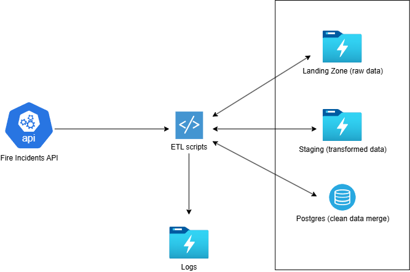

# Fire Incidents ETL Pipeline

An ETL project that ingests, cleans, and models fire incident data using Python and PostgreSQL.

<p align="center">
  
</p>

This is a simple solution that works with fire incidents data from https://data.sfgov.org/Public-Safety/Fire-Incidents/wr8u-xric/about_data
The intention of this ETL was to follow a medallion-alike architecture, having a Landing zone (bronze layer), Staging (silver layer) and Postgres DB containing merged data (golden layer)
The project works as follows:

## 1. Extraction 
Data is collected from the API and stored in raw format as a compressed json, this helps to have a track of all historical data in its original form in case something happens in the future in the other layers. Storing it in a compressed format, helps us to reduce storage space, which allows the project to be cost efficient.
This part of the ETL checks when is the maximum `date_as_of` date, as it is the attribute that tells when a record was updated. If there is nothing in the DB, it will execute a historical load, otherwise, it will get the records that were updated after that (like a delta load)

## 2. Transformation
In this part, json data is read and an formatted into a defined structure, then it is deduplicated based on its `id` column and a schema enforcement is applied, to keep all data types consistent. Finally, it is loaded into the `staging` path as a parquet, which will allow us to also keep track of how data has been evolving.

## 3. Loading
The last step, data loading, reads parquet file and stores that data into a staging table. After that, a merge operation is performed from that staging table into the final table `fire_incidents`. With this approach we allow this pipeline to be highly scalable, as it is not reading all data from data table to perform the merging operation, instead, we only have the new data stored in the staging table coming into the final table using the `INSERT` statement along with `ON CONFLICT (id) DO UPDATE`.

This project was built thinking on the feature, so hardcoding was avoided to let new etl pipelines for new datasets be included in an easy way, reusing the existing etl scripts.
Also, the structure of data folders was designed to work on a daily basis execution, so we can have track of the execution of each day, because of that, you will be able to see it like `data/landing/yyyy/mm/dd/` that way we allow the different scripts were to look each day, without harcoding any value.

---

## How to run the Pipeline

### 1. Clone the Repository

```bash
git clone https://github.com/yourusername/fire-incidents-etl.git
cd fire-incidents-etl
```

### 2. Create Virtual Environment

```bash
python -m venv fire_incidents_env
.\fire_incidents_env\Scripts\activate # On Mac: source fire_incidents_env/bin/activate 
pip install -r requirements.txt
```

### 3. Configure Environment Variables
Create a `.env` file at the root based on the `.env.example` file

### 4. Start the PostgreSQL container
Make sure you update the `POSTGRES_USER`, `POSTGRES_PASSWORD` and `POSTGRES_DB` to the credentials and DB name you want
```bash
docker-compose up -d
```

### 5. Run the pipeline
```bash
python scripts/fire_incidents_etl.py
```
